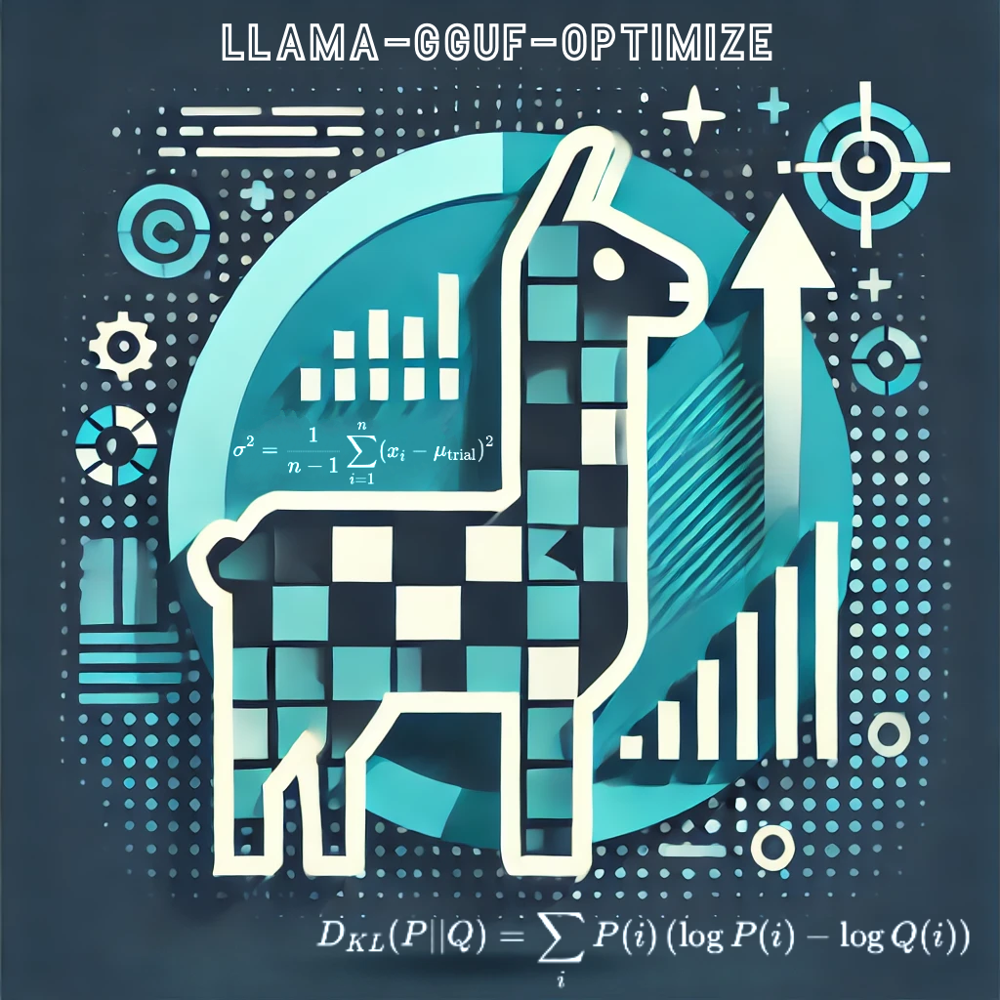

<p align="center">
  ❯ llama-gguf-optimize</code>-logo">
</p>
<p align="center">
    <h1 align="center"><code>❯ llama-gguf-optimize v0.5</code></h1>
</p>
<p align="center">
    <em>Optimize. Quantize. Perfect the Efficiency.</em>
</p>
<p align="center">
  <!-- local repository, no metadata badges. --></p>
<p align="center">
    <em>Built with the tools and technologies:</em>
</p>
<p align="center">
  
  
  
  
  
  
</p>

<br>

#####  Table of Contents

- [Overview](#overview)
- [Features](#features)
- [Modules](#modules)
- [Getting Started](#getting-started)
  - [Prerequisites](#prerequisites)
  - [Installation](#installation)
  - [Usage](#usage)
  - [Running Tests](#running-tests)
- [Project Roadmap](#project-roadmap)
- [Contributing](#contributing)
- [License](#license)
- [Acknowledgments](#acknowledgments)

---

##  Overview

**Llama-gguf-optimize** is the result of work and research in creating high-quality quantizations for multilingual models, specifically the [salamandra](https://hf.co/collections/BSC-LT/salamandra-66fc171485944df79469043a) series. With a focus on preserving language diversity, the project leverages [llama.cpp](/ggerganov/llama.cpp)’s importance matrix approach to minimize quantization loss across distinct language domains. Existing importance matrices often lack even basic multilingual support, so this toolkit includes tools and scripts to generate custom importance matrices and refined quantizations, tailored for datasets beyond common sources like WikiText. While initially addressing quantization needs for 2B models, **llama-gguf-optimize** has grown into a broader resource, providing insights and tools for other researchers facing similar challenges.

It currently contains new scripts to help analyze dataset performace in i-matrix based qunatization, the notes [on_kl-divergence-optimization.md](on_kl-divergence-optimization.md) which summarize various discussions on llama.cpp regarding imatrices, as well as the original notes used to help inform my search to create these datasets, and the Jupyter notebooks that were used to generate the datasets and the quantized models. These notes are in some cases incorrect, but will eventually be updated with later insights. The notebooks will be generalized into scripts to help others in the process, regardless of the datasets they are using.

The [best_bub.py](src/best_bub.py) script is a performance optimization tool developed to fine-tune batch (`--batch`) and ubatch (`--ubatch`) parameters for logit generation processes in _llama.cpp_, such as those in _llama-perplexity_ or _llama-imatrix_. Using a fully Bayesian approach, this script explores runtime configurations tailored to your model’s context size and available memory resources, achieving notable time savings over default configurations (with a 33% improvement observed in the author's case). `best_bub.py` employs [Optuna](https://optuna.org)’s _TPESampler_ for intelligent sampling and incorporates Bayesian metrics and a _MedianPruner_ to refine trial evaluations based on runtime performance trends. This approach ensures optimal parameter selection while adapting to real-time memory constraints and model-specific behavior.

The [kl_d_bench.py](src/kl_d_bench.py) script coordinates the generation and comparison of logits across models, running through the dataset one chunk at a time. By handling each chunk sequentially, it keeps storage needs low—requiring only enough space for the current and previous chunks—while ensuring consistency and smooth progress. `kl_d_bench.py` can easily pause and pick up where it left off. Though currently optimized for single-chunk processing, future updates could allow multi-chunk handling.

The [generate_logits.py](src/generate_logits.py) script is a specialized tool designed to generate and store logits efficiently from a _llama.cpp_ model for large datasets. Built to overcome limitations of storage and memory efficiency in previous tools, it uses the _HDF5 format_ for compact storage and a reuse list to manage processed chunks, making it resumable and able to operate within limited disk space. These optimizations make `generate_logits.py` particularly useful for quantization analysis and similar downstream tasks that require consistent, efficient logit generation for models with large vocabulary sizes or extensive datasets.

The [compare_logits.py](src/compare_logits.py) script is a specialized tool for comparing sets of logits on a chunk-by-chunk basis, providing detailed KL-divergence metrics essential for quantization analysis. By calculating statistics such as median, standard deviation, and specific percentiles (e.g., 90th, 95th, 99th) for each chunk, it highlights outliers where quantization diverges most from baseline. These metrics, stored in an HDF5 format for efficient storage and resumability, can support the evaluation and calibration of quantization quality, particularly for fine-tuning dataset importance.


---

##  Features

|    |   Feature         | Description |
|----|-------------------|---------------------------------------------------------------|
| ⚙️  | **Architecture**  | The project utilizes a modular src directory with various scripts for quantization, model optimization, and logging. It adheres to Python best practices and leverages external libraries for machine learning tasks. |
| 🔩 | **Code Quality**   | (Continually improving towards) High-quality code maintained through static type checking (`py.typed`), documentation within files such as `src/quantize.ipynb`, and consistent use of tools like Optuna and PyTorch for optimization and model execution. |
| 📄 | **Documentation**  | Comprehensive documentation is available, as well as configuration details in `pyproject.toml` and `requirements.txt`. Additional markdown files provide insights into the repository's goals and methodologies, enhancing user understanding. |
| 🔌 | **Integrations**   | Key integrations with machine learning libraries (PyTorch, NumPy), optimization tools (Optuna), and data handling modules (HDF5). External dependencies are well-managed and specified in `requirements.txt`. |
| 🧩 | **Modularity**     | The codebase is highly modular, with functionalities split into different scripts within the src directory. Core functions for quantization and logging are separated into dedicated files (`library.py`, `gguf_optimize_logging.py`), enhancing reuse. |
| 🧪 | **Testing**        | Using _unittest_ scripts like `compare_logits.py` indicate functionality for validation through KL-divergence calculations, suggesting an implicit testing strategy. |
| ⚡️  | **Performance**   | Optimized for performance and memory usage, and detailed logging configurations that can dynamically adjust based on runtime needs (`gguf_optimize_logging.py`). |
| 🛡️ | **Security**       | No explicit security measures are mentioned, but the use of versioning and static type checking enhance maintainability and reliability, indirectly supporting secure code practices. |
| 🔗  | **Dependencies**   | Managed through `pyproject.toml` and available in `requirements.txt`, including PyTorch for deep learning tasks, NumPy for numerical computation, HDF5 for dataset handling, and Optuna for optimization tasks. |
```

---

##  Repository Structure

```sh
└── /
    ├── LICENSE.md
    ├── README.md
    ├── assets
    │   └── llama-gguf-optimize.png
    ├── bub_execution_flow.md
    ├── on_kl-divergence-optimization.md
    ├── on_perplexity.md
    ├── on_quantization.md
    ├── pyproject.toml
    ├── quantizations.yaml
    ├── readme-ai.md
    ├── requirements.txt
    ├── src
    │   ├── best_bub.py
    │   ├── compare_logits.py
    │   ├── generate_logits.py
    │   ├── gguf_optimize_logging.py
    │   ├── gguf_optimize_model_fns.py
    │   ├── imatrix_dataset.ipynb
    │   ├── kl_d_bench.py
    │   ├── library.py
    │   ├── quantize.ipynb
    │   ├── tests
    │   └── version.py
    └── uv.lock
```

---

##  Modules

<details closed><summary>.</summary>

| File | Summary |
| --- | --- |
| [requirements.txt](requirements.txt) | Lists essential external libraries ensuring consistent development environment across different setups. Highlights dependencies crucial for model optimization and data processing, supporting repositorys focus on advanced quantization techniques and optimization benchmarks. |
| [pyproject.toml](pyproject.toml) | Defines project metadata and dependencies for llama-gguf-optimize, ensuring compatible Python version and listing essential packages for machine learning tasks. Streamlines building and managing project versions with Hatch tooling support. |
| [quantizations.yaml](quantizations.yaml) | (A dependency of the quantization notebook) Lists available quantization methods for model optimization, detailing their sizes, perplexity impacts, and types, essential for configuring efficient machine learning model storage and inference within the repositorys framework. |

</details>

<details closed><summary>src</summary>

| File | Summary |
| --- | --- |
| [version.py](src/version.py) | Defines version for package management. |
| [library.py](src/library.py) | Custom __library__ tag used in Python packages to indicate the source of the library, facilitating easy identification and tracking of dependencies within the repositorys ecosystem. |
| [compare_logits.py](src/compare_logits.py) | Script compares KL-divergence between two HDF5 files containing softmax logits from machine learning models. Calculates statistics per chunk, updates cumulative overall stats, and saves results to an output file. Supports processing specific chunks and logging verbosity levels. |
| [gguf_optimize_model_fns.py](src/gguf_optimize_model_fns.py) | Estimates model parameters and precision for optimization within repository architecture. Utilizes metadata for parameter estimation and calculates bits per weight to assess model efficiency, logging critical information for debugging and verification. |
| [best_bub.py](src/best_bub.py) | The primary purpose of `best_bub.py` is to automate the search for the best possible `--batch` and `--ubatch` configuration (dubbed BUB within the context) that maximizes performance (inference speed). **Critical Features:**-**Parameter Tuning:** It uses tools like Optuna for hyperparameter optimization to explore different configurations of the models.-**Performance Evaluation:** Integrates with `llama_cpp` and other scientific computing libraries to evaluate how well each configuration performs on specific tasks.-**Efficiency Optimization:** Incorporates multiprocessing capabilities to distribute parameter tuning across multiple processes, enhancing computational efficiency.Overall, `best_bub.py` serves as a key component for efficiently optimizing model configurations to achieve the best performance in terms of speed and accuracy. |
| [quantize.ipynb](src/quantize.ipynb) | This code file is part of a repository focused on optimizing models, particularly for quantization. |
| [generate_logits.py](src/generate_logits.py) | The `generate_logits.py` script generates logits from a model, over a dataset, for further analysis and optimization.**Key Features-**Logit Generation: It generates logits from a given model output, enabling subsequent optimizations and comparisons.-**Integration with Repository Goals By creating detailed model outputs, it supports the repository’s aim to enhance model performance through various optimization techniques such as quantization and KL-divergence analysis. |
| [gguf_optimize_logging.py](src/gguf_optimize_logging.py) | Configures logging for library operations, setting up message formats and output levels to standard out, facilitating consistent logging across modules with versioning information included in debug mode outputs. |
| [imatrix_dataset.ipynb](src/imatrix_dataset.ipynb) | This notebook contains code to sample data from a dataset for generating an imatrix, in this case specifically targeting certain languages. |
| [kl_d_bench.py](src/kl_d_bench.py) | Orchestrates processing a dataset to generate and compare model logits, manages dataset input, ensures mutually exclusive options, validates parameters, sets logging level, and executes main function. Validates presence of necessary arguments and prevents conflicting options. |

</details>

<details closed><summary>src.llama_gguf_optimize</summary>

| File | Summary |
| --- | --- |
| [py.typed](src/llama_gguf_optimize/py.typed) | Enables static type checking for llama_gguf_optimize module, enhancing code reliability and maintainability within parent repositorys architecture focused on optimization and quantization techniques for machine learning models. |

</details>

---

Here’s a draft for the revised "Getting Started" section that integrates the specific commands and usage details for each script:

---

## Getting Started

### Prerequisites

- **Python**: Version 3.12 or compatible versions (3.6 and above may also work)
- Ensure the necessary libraries from `requirements.txt` are installed.

### Installation

1. Clone the repository:
   ```sh
   ❯ git clone <repository_url>
   ```

2. Navigate to the project directory:
   ```sh
   ❯ cd <project_directory>
   ```

3. Install the required dependencies (optional if using `uv`):
   ```sh
   ❯ pip install -r requirements.txt
   ```

### Usage

Each script in llama-gguf-optimize can be run independently, offering a range of model optimization, logit generation, and comparison capabilities:

- **Optimize Batch Sizes with `best_bub.py`**  
  Run the `best_bub.py` script to optimize batch (`--batch`) and ubatch (`--ubatch`) parameters:
  ```sh
  ❯ uv run src/best_bub.py --model <path_to_model> --context-size <size> [optional model parameters]...
  ```

  For a full list of options, see:
  ```sh
  ❯ uv run src/best_bub.py --help
  ```

- **Generate Logits with `generate_logits.py`**  
  Use `generate_logits.py` to generate and save logits to an HDF5 file:
  ```sh
  ❯ uv run src/generate_logits.py --model <path_to_model> --dataset <path_to_dataset> --output <output_file>
  ```

  For additional options:
  ```sh
  ❯ uv run src/generate_logits.py --help
  ```

- **Compare Logits with `compare_logits.py`**  
  The `compare_logits.py` script calculates KL-divergence between two HDF5 logit files:
  ```sh
  ❯ uv run src/compare_logits.py <baseline_file> <target_file> --output_file <output_file>
  ```

  Access more options with:
  ```sh
  ❯ uv run src/compare_logits.py --help
  ```

- **Orchestrate Logit Generation and Comparison with `kl_d_bench.py`**  
  Run `kl_d_bench.py` to manage logit generation and comparison in a synchronized workflow:
  ```sh
  ❯ uv run src/kl_d_bench.py --baseline-model <baseline_model> --target-model <target_model> --dataset <path_to_dataset> --output-file <output_file>
  ```

  For further options:
  ```sh
  ❯ uv run src/kl_d_bench.py --help
  ```

### Running Tests

Execute the full test suite using:
```sh
❯ PYTHONPATH=src uv run --module unittest discover -s src/tests
```

---

##  Project Roadmap

- [X] **`v0.1`**: <strike>best_bub.py script.</strike>
- [X] **`v0.3`**: <strike>generation and comparison scripts.</strike>
- [X] **`v0.5`**: <strike>kl-divergence comparison script.</strike>
- [ ] **`v0.5.n`**: Usage guides.
- [ ] **`v0.6`**: Convert jupyter notebooks to general scripts.
- [ ] **`v1.0`**: PyPl submission, github actions, changelog.
---

##  Contributing

Contributions are welcome! Here are several ways you can contribute:

- **[Report Issues](https://LOCAL///issues)**: Submit bugs found or log feature requests for the `` project.
- **[Submit Pull Requests](https://LOCAL///blob/main/CONTRIBUTING.md)**: Review open PRs, and submit your own PRs.
- **[Join the Discussions](https://LOCAL///discussions)**: Share your insights, provide feedback, or ask questions.

<details closed>
<summary>Contributing Guidelines</summary>

1. **Fork the Repository**: Start by forking the project repository to your LOCAL account.
2. **Clone Locally**: Clone the forked repository to your local machine using a git client.
   ```sh
   git clone .
   ```
3. **Create a New Branch**: Always work on a new branch, giving it a descriptive name.
   ```sh
   git checkout -b new-feature-x
   ```
4. **Make Your Changes**: Develop and test your changes locally.
5. **Commit Your Changes**: Commit with a clear message describing your updates.
   ```sh
   git commit -m 'Implemented new feature x.'
   ```
6. **Push to LOCAL**: Push the changes to your forked repository.
   ```sh
   git push origin new-feature-x
   ```
7. **Submit a Pull Request**: Create a PR against the original project repository. Clearly describe the changes and their motivations.
8. **Review**: Once your PR is reviewed and approved, it will be merged into the main branch. Congratulations on your contribution!
</details>

<details closed>
<summary>Contributor Graph</summary>
<br>
<p align="left">
   <a href="https://LOCAL{///}graphs/contributors">
      
   </a>
</p>
</details>

---

##  License

This project is protected under the [GNU Lesser General Public License](https://www.gnu.org/licenses/lgpl-3.0.en.html) License. For more details, refer to the [LICENSE](LICENSE.md) file.

---

##  Acknowledgments

- List any resources, contributors, inspiration, etc. here.

---
