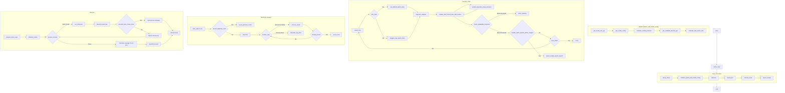

```mermaid
flowchart TD
    start[Start] --> parse_args[parse_args]
    parse_args --> main_execution --> finish[End]

    subgraph main_execution
        setup_study[setup_study] --> init_config[initialize_batch_and_model_config]
        init_config --> tokenization[tokenize]
        tokenization --> chunk_text[chunk_text]
        chunk_text --> exec_trials[execute_trials]
        exec_trials --> report[report_results]
    end

    subgraph initialize_batch_and_model_config
        get_model_size[get_model_size_gb] --> get_model_config[get_model_config]
        get_model_config --> est_precision[estimate_model_precision]
        est_precision --> get_mem[get_available_memory_gb]
        get_mem --> est_batch[estimate_max_batch_size]
    end

    subgraph execute_trials
        create_trial[create_trial]
        trial_loop{more_trials?} -->|Yes| create_trial
        create_trial --> check_default{first_trial?}
        check_default -->|Yes| use_default[use_default_batch_sizes]
        check_default -->|No| suggest_new[suggest_new_batch_sizes]
        use_default --> obj_wrapper[objective_wrapper]
        suggest_new --> obj_wrapper
        obj_wrapper --> update_best[update_best_chunk_time_with_pvalue]
        update_best --> bayesian_update[update_bayesian_mean_variance]
        bayesian_update --> update_best
        update_best --> check_prob{check_probability_threshold}
        check_prob -->|Below threshold| issue_warning[issue_warning]
        check_prob -->|Meets threshold| check_size{smaller_batch_ubatch_within_margin?}
        check_size -->|Yes| select_smaller[select_smaller_batch_ubatch]
        check_size -->|No| trial_loop
        trial_loop -->|No| done[Done]
    end

    subgraph objective_wrapper
        start_proc[start_subprocess] --> check_duplicate{detect_duplicate_trial?}
        check_duplicate -->|Yes| reuse_result[reuse_previous_result]
        check_duplicate -->|No| objective_call[objective]
        objective_call --> monitor_loop{monitor_loop}
        monitor_loop -->|Queue not empty| process_result[process_result]
        process_result --> check_prune{should_prune?}
        check_prune -->|Yes| prune_trial[prune_trial]
        check_prune -->|No| monitor_loop
        monitor_loop -->|Process done| calc_avg[calculate_avg_time]
    end

    subgraph objective
        prep_args[prepare_llama_args] --> init_model[initialize_model]
        init_model --> process_chunks{process_chunks}
        process_chunks -->|Each chunk| run_inference[run_inference]
        run_inference --> track_time[Record chunk time]
        track_time --> check_time{exceeds_best_chunk_time?}
        check_time -->|Yes| send_prune[Send prune message]
        check_time -->|No| queue_chunk_time[Report chunk time]
        queue_chunk_time --> process_chunks
        process_chunks -->|Done| calc_avg_time[Calculate average chunk time]
        calc_avg_time --> send_final[Send final result]

        send_prune --> end_process[End process]
        send_final --> end_process
    end
```