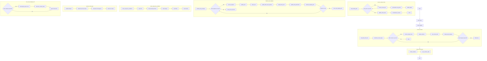

```mermaid
flowchart TD
    start[Start] --> parse_args[parse_args]
    parse_args --> setup_logging[setup_logging]
    setup_logging --> process_chunks[process_chunks] --> finalize_processing[finalize_processing] --> finish[End]

    subgraph process_chunks
        load_state[load_state_from_file] --> determine_range[determine_chunk_range]
        determine_range --> chunk_loop{More chunks to process?}
        chunk_loop -->|Yes| process_chunk[process_single_chunk]
        process_chunk --> update_stats[update_statistics]
        update_stats --> save_stats[save_chunk_stats]
        save_stats --> handle_stopping[handle_early_stopping]
        handle_stopping --> stop_check{Early stopping requested?}
        stop_check -->|Yes| break_loop[Break loop]
        stop_check -->|No| chunk_loop
        chunk_loop -->|No| done_chunks[Done]
    end

    subgraph process_single_chunk
        load_data[load_existing_data] --> part_loop{More parts to process?}
        part_loop -->|Yes| process_part[process_chunk_part]
        process_part --> divergence_log_probs[kl_divergence_log_probs]
        divergence_log_probs --> digest_update[update_digest]
        process_part --> part_loop
        part_loop -->|No| stats_update[update_chunk_stats]
        stats_update --> kl_values[concatenate_kl_values]
        kl_values --> done_single_chunk[Done]
    end

    subgraph handle_early_stopping
        init_stopping[initialize_early_stopping] --> segment_loop{More segments in chunk?}
        segment_loop -->|Yes| segment_process[process_segment]
        segment_process --> prior_update[update_prior]
        prior_update --> kuiper_test[kuiper_test]
        kuiper_test --> effect_size_update[update_effect_sizes_pvalues]
        effect_size_update --> decay_adjust[adjust_decay_rate]
        decay_adjust --> beta_params_update[update_beta_parameters]
        beta_params_update --> stopping_prob[calculate_stopping_prob]
        stopping_prob --> stop_decision{Decide if to stop}
        stop_decision -->|Yes| save_stopping_info[save_early_stopping_info]
        stop_decision -->|No| segment_loop
        segment_loop -->|No| save_prior[save_prior_and_stats]
    end

    subgraph finalize_processing
        finalize_stats[finalize_statistics] --> common_state[save_common_state]
    end

    subgraph check_output_file_conditions
        check_conditions[check_output_file_conditions] --> file_open[Open File]
        file_open --> chunks_check[Check Existing Chunks]
        chunks_check --> digest_check[Check Digest]
        digest_check --> stats_load[Load Stats]
        stats_load --> return_conditions[Return Stats]
    end

    subgraph process_chunk_part
        validate_shapes[Validate Shapes] --> handle_values[Handle Non-Finite Values]
        handle_values --> calculate_divergence[Calculate KL Divergence]
        calculate_divergence --> part_return[Return KL Values]
    end

    subgraph save_early_stopping_info
        stopped_check{Early stopping requested?} -->|Yes| set_flag[Set stopped_early to True]
        set_flag --> common_state_call[Call save_common_state]
        common_state_call --> stopping_info_return[Return Saved Info]
        stopped_check -->|No| stopping_info_return
    end
```